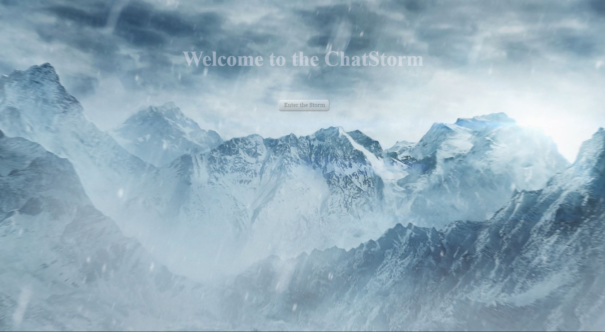
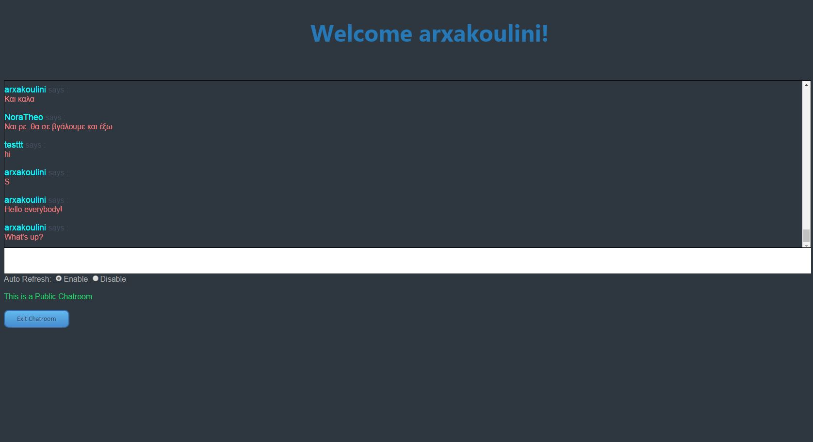

# ChatStorm
-- Web-based Chat Application --

A Web-based Chat Application which supports online chatting via a public Chatroom. Registration and Login features are implemented. The following technologies were used: <b>MySQL</b>, <b>JQuery</b>, Object-Oriented <b>PHP</b>, <b>HTML5</b> and <b>CSS</b>.

<a href="http://chatstorm.3eeweb.com/arxa/PHP/index.php">Website Link</a>
 
 - January 2016, Thessaloniki, Greece
 - Nikiforos Archakis

 	

	

